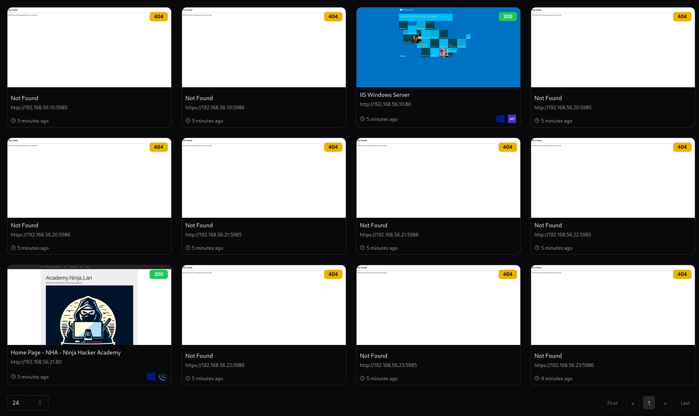
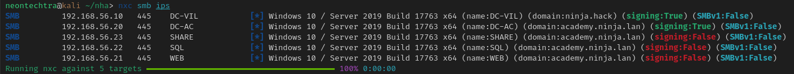

### NHA Part 1

#### Recon and Scanning

##### Lab Provided By: Mayfly - GOADv3

##### Scenario:

You've been hired to do a pentest for the Ninja Hacker Academy! there are flags throughout the machines you have been asked to collect and report back once you are complete. The environment does have Windows Defender but no one will stop you if payloads are caught. "Best of luck!" was all they said during the kick off meeting

#### Scanning

We will start off with a classic `nmap` scan, get a quick lay of the land and see what machines are available to us:

```bash
sudo nmap -sT -Pn -v -PE -T4 --open -p 21,22,23,25,80,110,139,143,389,443,445,636,1433,3000,3128,3306,3389,5432,5000,5985,5986,6667,8000,8010,8020,8080,8443,8888,10443 192.168.56.0/24 -oA flyover-nha
```

:::info
Why Use Sudo?
Its been observed that using `sudo` for nmap can result in better scanning, possibly due to the root privleges allowing for more privleged detection methods:
See: [Here](https://security.stackexchange.com/questions/74493/different-results-using-nmap-with-without-sudo)
:::

:::tip
In a true engagement, I have heard of people leveraging Qualys or Nessus to do this preliminary scanning! Then taking the results and using targeted nmap scans - The inverse is also true, you could take a large nmap scan and then leverage the results for your vulnerability scanning (which is outside the scope of this lab)
:::

#### Parsing our results

##### Getting alive IPs

A very simple way to get our alive IPs is just via a basic `cat`, `grep`, `cut`.

```bash
cat scan.gnmap | grep Up | cut -d ' ' -f 2
```

Giving us the following results:

```text
192.168.56.10
192.168.56.20
192.168.56.21
192.168.56.22
192.168.56.23
```

- You may have a `192.168.56.1` address but that would be ... well you! so we can exclude it from our list

##### Enumerate web services

Another thing we could do is enumerate web services - Now the list we have here is quite small but in a larger environment it may be worth while to use tools such as `gowitness` to audit any web services to see what they are.

```bash
gowitness scan nmap -f nmapfile.xml --write-db
```

- Have a nessus file? check the help pages! you can use that as well!

You can then view a nice interface to view your results with the following

```bash
gowitness report server
```

- Depending on how you're routing web traffic / have your kali setup you may need to use the `--host` flag and make some adjustments

*Example output:*


We can quickly check that IIS server for enrollment `https://{ip}/certsrv/certfnsh.asp` but no luck.

That gives us a potential option of the `http://192.168.56.21` web application

- We will make a note of that and continue finishing our recon

#### Configure our environment

Next we can do a quick sweep with `nxc` and prep our environment a little

- Should we adjust our /etc/hosts?

  - On larger engagements this will be impractical (and hopefully in an "assumed breach" scenario, the VM you have is setup properly), however it is still good information if you need to ensure your traffic routes properly to a specific workstation/DC
- How about krb5.conf

  - Get that setup properly as well

    - Same notes about practicality as above but still worth remember it **could** be something for troubleshooting

##### Sweeping with `nxc`

```text
nxc smb ips
```

- Where `ips` is a file with the ips we discovered

*Results in the following:*


##### Editing /etc/hosts

```text
# NHA
192.168.56.10 DC-VIL.ninja.hack ninja.hack DC-VIL
192.168.56.20 DC-AC.academy.ninja.lan academy.ninja.lan DC-AC
192.168.56.21 web.academy.ninja.lan web
192.168.56.22 sql.academy.ninja.lan sql
192.168.56.23 share.academy.ninja.lan share
```

- You can place the above into your /etc/hosts

##### Editing /etc/krb5.conf

- If you dont have this and are using a debian based distro (Kali)

  - `sudo apt-get install -y libkrb5-dev`

```text
[libdefaults]
  default_realm = ninja.hack
  kdc_timesync = 1
  ccache_type = 4
  forwardable = true
  proxiable = true
  fcc-mit-ticketflags = true
[realms]
  ninja.hack = {
      kdc = dc-vil.ninja.hack
      admin_server = dc-vil.ninja.hack
}
  academy.ninja.lan = {
      kdc = dc-ac.academy.ninja.lan
      admin_server = dc-ac.academy.ninja.lan
}
```

#### Check for user list

Theres a lot of ways to try and do this - a couple of good ones:

```bash
nxc ldap {DCIP} -u guest -p '' --users
```

or

```bash
lookupsid.py anonymous@$DCIP
```

There is many more you can google/look up, but no luck today!

#### Check for shares

```bash
enum4linux-ng -U $TARGET
```

```bash
enum4linux-ng -U $DCIP 
```

Again no such luck but if you had a set of creds in assumed breach, or found a set with a bit of OSINT you could try the above again.

#### Generate a Relay List

We should generate potential smb relay targets, smb allows us to do this quickly:

```bash
nxc smb 192.168.1.0/24 --gen-relay-list relay_list.txt
```

#### Listen and Poison

We could also potentially listen and poison for hashes with `Responder`

`Responder -I {interface}`

- You can also use `-A` if you just want to analyze the traffic

But alas, no such luck again.

#### What have we learned so far?

- We have learned we have 2 domains `ninja.hack` and a child domain `academy.ninja.lan`
- Two DCs `DC-VIL` and `DC-AC`
- Reviewing our `nxc` output

  - The DCs have SMB Signing enabled
  - All machines appear to be using SMBv2

    - However signing is off on a few of them so SMB relays may still be abuseable

      - See [hackndo](https://en.hackndo.com/ntlm-relay/) for better - more accurate information.

        - As mentioned above and in this article also means if you see smbv1 set to true with signing set to true you should still add them as smbv1 doesnt **enforce** signing inherently

#### Wrapping Up

- For now that should be sufficient to get us started and we can begin looking at the web application
- Should we find any credentials we can use similar functions + more to try and get more information and repeat the process
