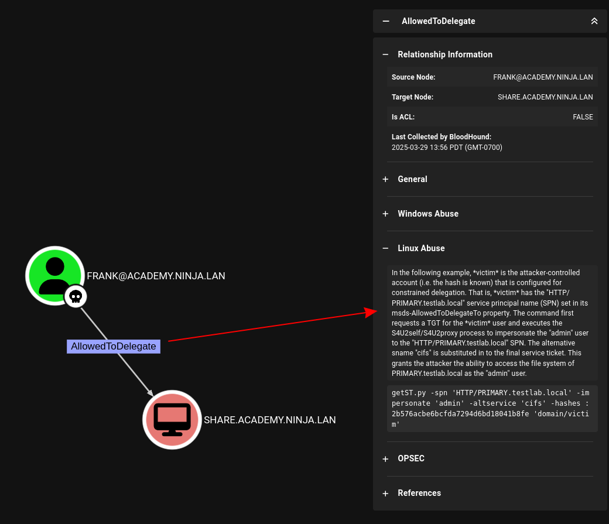
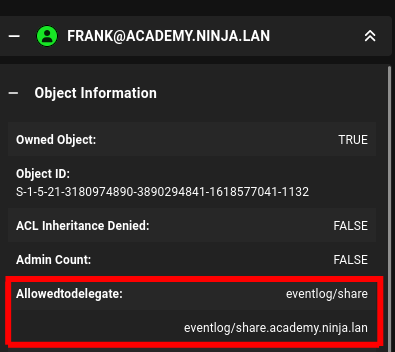
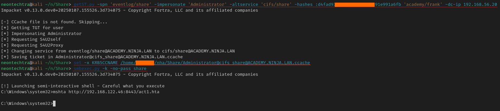
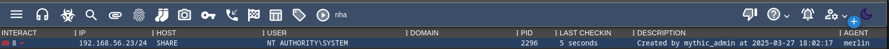
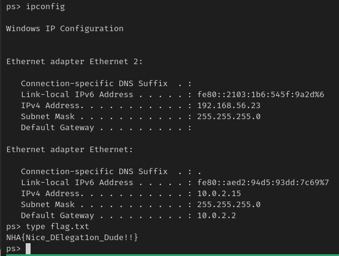

### NHA - Part 4

Not a very good ring to this title but just bear with me.

#### Frank

Last time we got a hash for Frank, so we can investigate his user in bloodhound to find our next path:



Easy enough - *hopefully*  - Lets give it a try

#### AllowedToDelegate

First we need to know what we can delegate as currently and then we flip from what we can to what we want.



So we can see that Frank is allowed to delegate with `eventlog` and we are going to try and switch that service to the mighty `cifs`

```bash
getST.py -spn 'eventlog/share' -impersonate 'Administrator' -altservice 'cifs/share' -hashes :d4fa[...]1a6fb 'academy/frank' -dc-ip 192.168.56.20
```



1. First command is the delegation work, using Franks hash we say: "I am the administrator and I need a ticket for CIFS, Here are franks credentials to say this is ok"
2. We set the ticket for our KRB5CCNAME (This will be the `export` command if using bash)
3. We use `smbexec` to get into the machine, and then call our `hta` to get a beacon

:::tip
You may be wondering why it is not `@share`

From what I understand if you're using kerberos tickets you can safely remove the `@` as you do not need to dilneate any username/hostname
:::



#### Harvest Flags and Dump Hashes

Lets do the same thing and upload our run.bat, use `shell c:\path\to\run.bat` for a quicker more interactive shell and collect our flags



Flag: `NHA{Nice_DElegat1on_Dude!!}`

We can then dump our hashes however we want, I just used mimikatz through mythic again and copied the output to a file. Parsing the data gives us the cleartext creds for Frank and the machine hash for Share.

for a preview of next time what happens if we mark SHARE as owned and check for a path to DC-AC?


Well ain't that somethin beautiful!
Onwards!
