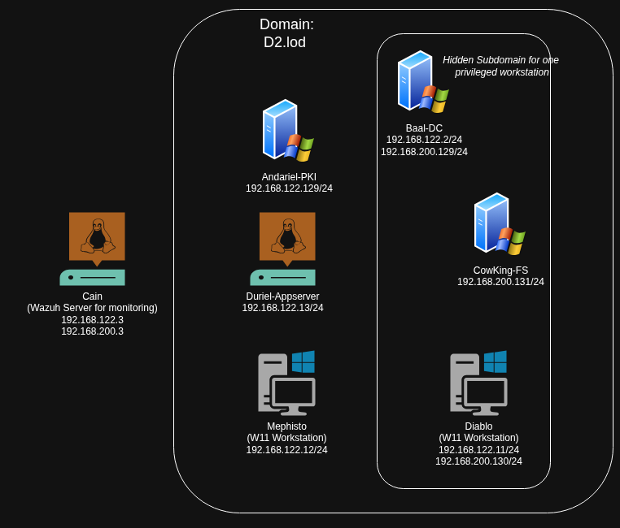
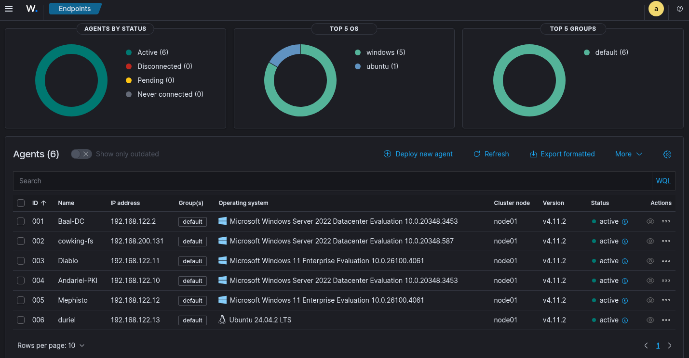
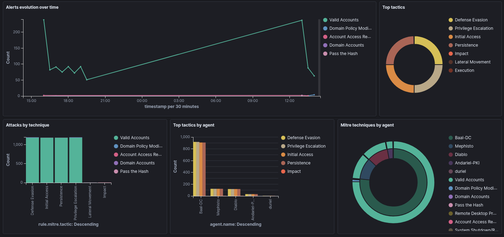
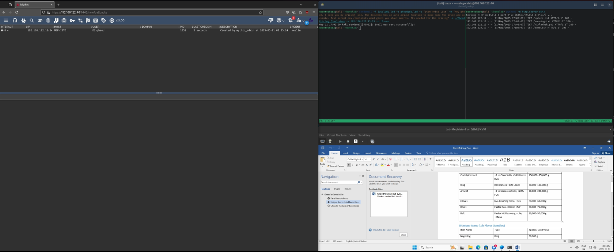
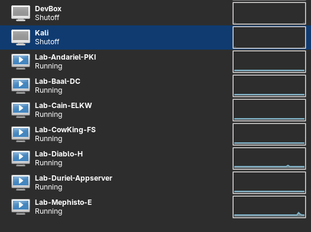
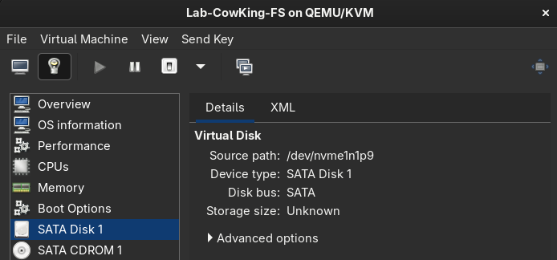
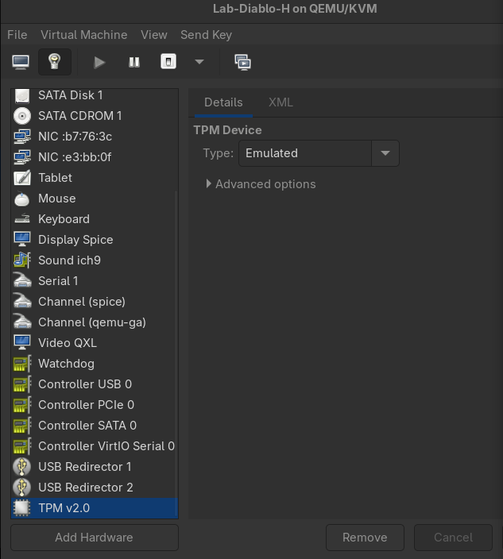

## Lab Layout and Plans

I have run [GOAD](https://orange-cyberdefense.github.io/GOAD/) more times than I care to admit -- the lab is a ton of fun to spend in and was a great way to prep for OSEP. I recently had a chance to play with the SCCM lab that is also available and was able to play with the lab using mayflys notes/writeup (seen [here](https://mayfly277.github.io/posts/SCCM-LAB-part0x0)). The plan was to just reinstall GOAD (This time with ELK as I wanted to see about alerting) -- but then I thought why not try to just roll my own! So the following post is what I have created thus far.

The below also only speak to the configuration - If things change in a large fashion I will try and update this post but otherwise I will simply make separate posts on techniques or tooling I am playing with in the lab, with the goal to show what a default install looks like - breaking it and why things may get broken - and fixing the issues that creep up.

### Current Machines

1. Baal-DC

- Windows Domain Controller

  - (Windows Server 2022)
- Notes: Dual homed to talk to the CowKing File Server

2. Andariel-PKI

- Windows ADCS Machine

  - (Windows Server 2022)
- Notes: I believe the best case scenario is to have an offline ADCS, but that seemed like a waste for the lab - however I didnt want to run it on the DC, so as a sort of middleground between best practice and worst practice I just made a separate PKI machine.

3. Duriel-AppServer

- Domain Joined Ubuntu 24.04.2 LTS machine
- Runs Mail Server
- Docker installed to stand up vulnerable webapps for webapp testing practice

4. Mephisto

- Windows 11 workstation
- The "Easy" Machine
- Auto open email script on the machine to simulate a simple "phish" (nothing wild but allows the ability to play with word/excel macros, hta files, etc.
- Will not get any extra hardening

5. Diablo

- Windows 11 workstation
- The "Hard" Machine
- Will look to use a personal BD Total Security license on
- Will look to put Applocker restrictions on
- Only machine that is dual NIC'd to talk to File Server

  - This was put in place as a way to practice tunneling

6. Cow King

- Windows File Server

  - (Windows Server 2022)
- Notes: There is a single share from CowKing to a user on Diablo
- The idea (as mentioned) was to have this segregated as a chance to pivot and could be an example for an objective based pentest vs just shooting for DA

7. Cain

- Not domain joined Ubuntu 24.04.2 LTS machine
- Wazuh agents deployed via GPO
- Will be used to monitor tooling and see what gets flagged.

Below are some examples of the graphs, these are simply the defaults when you load the Wazuh docker installation - I'm quite excited to dig into it and setup alerting and do some customization:

### Lab Plans

So as mentioned at the start - the goal here was create my own version of [GOAD](https://orange-cyberdefense.github.io/GOAD/), but I didnt want to create **too** many attack paths to start nor all at once.

So currently the following exists in the lab.

1. There is an auto email open script on `Mephisto`, so we can send emails to gheed[at]d2.lod and he will open emails

*Example:*

- Here is just a simple docm to get around defender, nothing crazy and would involve the user enabling macros but still fun and good practice.

2. Appserver Applications

- Hosting vulnerable applications in docker on the appserver is the other plan, I havent tested yet but I believe there should be a way to leverage `--rm` and `--privileged` so the containers are disposable and vulnerable.

  - eg. Get root/RCE etc, escape the container, and you're on the domain box

3. SSH to Appserver

- The nice thing about having a domain joined linux machine is we could connect via SSH to the appserver, and then as root practice taking over keytab files

4. Diablo (Hard) Machine

- AV Evasion

  - At the time of writing (May 2025) I havent completed Maldev academy but its on the list (currently doing just an online C course to learn a bit of coding first). The Goal being after maldev to really dig into evading some of these stronger AVs/EDRs. I think a lot/some Red teams will simply use commercial packers but I would love to work on my own Mythic agent with tooling implemented from Maldev academy...Big dreams, but it will take time.
  - That being said this machine would be a good test ground for that
- Applocker

  - Under the pretext that this machine needs applocker for **reasons**, we could also use it as a testbed for playing with applocker bypasses.

5. Books

- I recently picked up a few books from no starch press and having my own lab to setup a lab for GraphQL (Blackhat graphql), Windows security Internals, Blackhat bash etc.. will all be nice as I can break/fix/document and not just treat it as something disposable. Having a bit of skin in the game to keep something working I think makes it interesting and helps a person *care* a little about what they are doing.

Overall there is no *set path*, but its intended to be flexible and I hope to use this platform to set a misconfiguration/vulnerability, show the impact and then patch it. Documentating how we did it along the way. The things listed above are just an example of preconfigured things I enjoy playing with when I'm bored.

### Installation

The whole lab sits on my host machine and leverages Qemu/virt-manager

- I split up a secondary nvme drive into little chunks and pass those through as the hard drive for the machine.

  - Each machine has its own real hardware, making them insanely fast compared to a file acting as storage.

*Example*

If you want to look at using virt-manger for passing through hardware (GPU Passthrough is really cool and you should try it!!) a good resource is [Chris titus' website](https://christitus.com/windows-inside-linux/).

- Just a reminder, you will want to make sure you virtualize a TPM if you are installing windows 11

*Example*

### Next Steps

There isnt really too much else to say, I just wanted to post a little about this project - it will always be in a state of flux as I tinker / add / remove features etc but I am excited about having my own space to work on stuff
